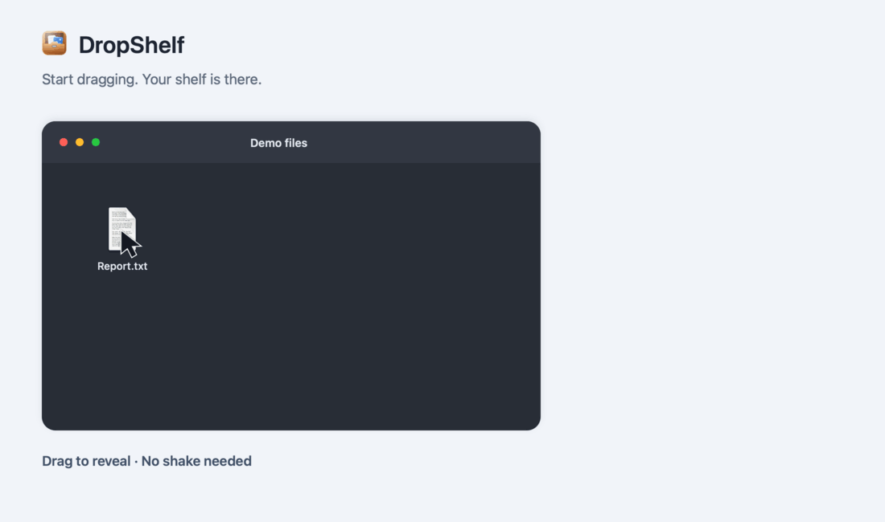

<p align="center">
  
</p>

<h1 align="center">DropShelf</h1>

<p align="center">
  A high-performance, native macOS utility designed to streamline drag-and-drop file organization, staging, and batch processing.
</p>

<p align="center">
  Developed by <strong>Arslan Hamid</strong>
</p>

## See it in action

Start dragging a file and DropShelf appears. No shake needed.



---

## Architectural Highlights

DropShelf combines low-level macOS system APIs with modern declarative user interface components:

- **Permissionless Drag and Shake Monitoring**: Combines real-time pasteboard event notifications, hardware cursor velocity analysis, and directional reversal detection to reliably track drag and shake gestures across any application without requiring invasive macOS Accessibility permissions.
- **Floating Panel Architecture**: Employs an `NSPanel` configured with non-activating panel styles, floating window levels, and full-screen auxiliary collection behaviors to ensure it remains accessible across all macOS spaces without interrupting active applications.
- **Native Multi-Item Drag Sessions**: Implements custom AppKit `NSDraggingSource` and `NSViewRepresentable` bridges to support multi-file drag operations that natively integrate with Finder, Mail, Terminal, and third-party applications.
- **Glassmorphic Presentation**: Rendered using AppKit's `NSVisualEffectView` backing layers, specular highlights, and fluid spring animations.

---

## Security and privacy

DropShelf performs local file processing without an analytics client. The build enables Hardened Runtime with ad-hoc signing; App Sandbox and notarization are not enabled. AirDrop and opening browser links can use network services. The optional BiRefNet model uses the network only when you press **Download Model** in Preferences or Image Tools. Image and PDF processing is local; source images are not uploaded. See [SECURITY.md](SECURITY.md) for the actual protections and limitations.

---

## Clipboard history

Right-click the menu-bar icon, choose **Show Clipboard**, then enable history. Copy text normally with ⌘C; the shelf stays hidden. Open it with the menu-bar icon or existing ⌘⇧Y shortcut and select Clipboard. Click an entry to copy the exact original text, expand it to read, or drag it into another app. Pins protect entries from capacity eviction but still expire.

History is **memory-only**, with a **one-hour default expiry**. Preferences offers 5 minutes, 15 minutes, 1 hour, 4 hours or 24 hours. Disabling, quitting, locking or sleeping clears history. Only enablement and expiry settings are persisted. Saved entries are copied back for the current Mac only. Text bytes, spaces, tabs, line endings and URL spelling are preserved; visual previews do not alter exports. Rich formatting and images are outside this feature.

Up to 50 entries are retained, with 32 MiB per capture and 128 MiB of retained payloads. Oversized entries are refused with a message, never silently shortened. Supported sensitive markers are excluded, but unmarked secrets and other apps' access to the original system clipboard cannot be prevented by DropShelf. See [Clipboard privacy and exact-text behavior](docs/CLIPBOARD_PRIVACY.md).

## Core Capabilities

### 1. Adaptive Drag Monitoring and Auto-Summon
- **Show on Drag (Default)**: The shelf starts appearing as soon as a supported content drag is detected; no shaking or edge proximity is required.
- **Optional Shake-Only Mode**: Enable "Require a shake to show the shelf" in Preferences to summon by shaking while dragging instead. This setting is off by default and is remembered across launches.
- **Window Movement Filter**: Moving a window without a fresh supported drag payload does not summon the shelf.
- **Global Hotkey Support**: Press `Command + Shift + Y` at any time to toggle the shelf manually.
- **Edge Tab Drag-Over Expansion**: When collapsed to an edge tab, dragging any file or folder directly over the tab automatically expands the full shelf. As soon as the item is dropped in, DropShelf smoothly returns to the collapsed edge tab.
- **Auto-Hide on Completion**: When all items are dragged out or dismissed, the shelf smoothly hides to keep the workspace uncluttered.

### 2. Dual Transfer Modes: Copy and Cut
DropShelf provides a dedicated transfer mode switch:

- **Copy Mode (Default)**: Dragging files out of DropShelf explicitly requests copy-only operations from Finder (`[.copy]`). Finder duplicates them to the target destination without moving source files, even when dragging between folders on the same APFS/HFS+ volume.
- **Cut Mode**: Dragging files out of DropShelf advertises move operations to Finder (`[.move, .copy]`), enabling Finder's native move semantics across directories. If an item is dragged back to its origin folder, Finder retains it safely in place without accidental trashing or deletion.

### 3. Quick Action Grid
The upper toolbar hosts an interactive action grid for rapid single-click or drag-targeted file manipulation:

- **Zip**: Compresses selected or dragged items into an archive using maximum `-9` compression. Inputs from different directories are placed under separate `Source-N` folders inside the archive, preserving duplicate filenames. Any staging or ZIP failure rejects the archive.
- **Copy Path**: Copies POSIX file paths directly to the system pasteboard as formatted text and NSURL objects.
- **AirDrop**: Triggers the native macOS sharing service anchored directly to the panel.
- **Desktop**: Routes items directly to the Desktop directory (`~/Desktop`) with automatic numerical collision resolution.
- **Downloads**: Routes items directly to the user Downloads directory (`~/Downloads`) with automatic collision resolution.
- **Images**: Opens image resize, conversion and local background-removal tools. Input and output formats come from this Mac's ImageIO codecs, with explicit safeguards for transparency, animation and bit depth.
- **PDF**: Merges PDFs, extracts or reorders pages, and creates PDFs from images.
- **Trash**: Safely moves items to the macOS Trash via `FileManager.default.trashItem`.

Image/PDF tools create new files and preserve originals. Long operations show progress and a Cancel control. Full BiRefNet background removal requires an optional, checksum-verified 496 MB model and macOS 15 or later. Install it explicitly with **Download Model** under Preferences or **Images > Remove background**. After installation, choosing Quality uses the local model automatically. Processing never starts a download or repair. You can remove the installed model from the same controls. Apple Vision is a separate local option on macOS 14 or later and needs no download. The app and disk image do not contain model weights. See [Media tools and cancellation](docs/MEDIA_TOOLS.md) for format support, quality boundaries and cancellation behavior.

### 4. Stack and Separation Controls
- **Accessible Control Bar Placement**: The **Stack All / Unstack** button is positioned directly between the **Drag All** pill and **Select All** button above your items for prominent visibility and instant access.
- **Stack All**: Aggregates all current shelf items into a single consolidated stack card that can be dragged and dropped as a unified batch.
- **Unstack**: When files are stacked, the button automatically highlights in blue and displays "Unstack" for single-click expansion back into individual cards.
- **Separate**: Expands grouped stacks into individual file cards for granular inspection and one-by-one dragging.
- **Card-Level Split**: Hovering over any grouped stack card reveals a dedicated split button to unpack only that specific group.

### 5. Multi-Card Selection and Dragging
- **Command-Click**: Toggle selection for individual cards.
- **Shift-Click**: Select contiguous ranges of cards.
- **Command-A**: Select all cards on the shelf simultaneously.
- **Escape**: Deselect all cards.
- **Drag-Any-To-Drag-All**: When multiple cards are selected, dragging any selected card initiates an AppKit dragging session carrying all selected items in a single drop.
- **Drag All Handle**: A dedicated toolbar handle enables dragging the entire contents of the shelf at once without requiring prior selection.

### 6. Ephemeral File Lifecycle Management
Generated archives and PNGs are staged in the application temporary directory. Clearing or dismissing them retains their files in Recent Drops history (up to 20 entries). Clearing history or evicting an entry removes generated files that are no longer referenced. Startup and normal termination also clean staging. Original files are never automatically deleted by shelf/history cleanup. History is session-only and cannot recover original files moved or deleted elsewhere.

### 7. Launch at Login
DropShelf integrates natively with macOS Service Management (`SMAppService.mainApp`). Users can enable or disable launching DropShelf automatically on system startup directly through DropShelf Preferences or via the right-click menu bar context menu.

### 8. Audio Feedback Configuration
DropShelf provides subtle audio cues for item drops, separations, stack grouping, and quick actions. Sound effects can be toggled on or off directly through Preferences or via the status bar context menu.

### 9. Light, Dark, and System Auto Themes
DropShelf features a flexible appearance system:
- **Auto (Default)**: Automatically tracks macOS system appearance preferences.
- **Dark Mode**: Sleek obsidian translucent glass with high-contrast typography and subtle borders.
- **Light Mode**: Frosted Apple sidebar glass with rich dark typography, refined pill buttons, and specular highlights.

### 10. Window Opacity and Glass Density Controls
Users can tailor the visual presence of the shelf directly in Preferences:
- **Opacity Slider**: Fine-tune backdrop translucency between 40% (whisper-thin overlay) and 100% (solid focus).
- **Glass Materials**: Choose between standard Blur, Ultra Thin Material, or classic macOS HUD Window backing.

### 11. Smart Content Cards
DropShelf natively parses non-file content into specialized interactive cards:
- **Interactive Color Swatches**: Dragging or piping color hex codes (e.g., `#3B82F6`, `#FF5733`) or RGB values renders a real-time color chip with RGB breakdown and a single-click "Copy Hex" action.
- **Web Link Previews**: Dropped web URLs display a dedicated globe badge, domain extraction, and single-click "Open in Browser".
- **Text Snippets**: Dropped code snippets and notes feature instant single-click clipboard copying.

### 12. Recent Drops History Drawer
Accidentally cleared files or completed drops can be recovered instantly. Clicking the clock icon in the shelf header reveals the Recent Drops History drawer, displaying recent items with icons, and one-click "Restore" and "Restore All" recovery actions.

### 13. Finder Context Menu Integration
DropShelf includes a native macOS Finder Quick Action. Users can right-click any file or folder in Finder and select **Send to DropShelf** from Quick Actions. Installation can be executed with a single click in DropShelf Preferences.

### 14. Terminal CLI and URL Scheme Automation
DropShelf includes a command-line interface (`dropshelf`) and registers the `dropshelf://` custom URL scheme:
- `dropshelf file1.pdf file2.png`: Adds files directly to DropShelf from any terminal window.
- `dropshelf --text "#3B82F6"`: Adds color swatches or text notes directly.
- `echo "https://apple.com" | dropshelf`: Pipes standard input into DropShelf.
- `dropshelf --toggle`: Toggles shelf visibility.
- `dropshelf --collapse`: Collapses shelf to the edge tab.
- `dropshelf --uncollapse`: Uncollapses and locks shelf open.
- `dropshelf --clear`: Clears current shelf items.
- `dropshelf --history`: Opens the Recent Drops History drawer.
- `dropshelf --theme <dark|light|auto>`: Changes the appearance theme.
- `dropshelf --mode <copy|cut>`: Sets transfer mode to Copy (duplicate) or Cut (move).
- `dropshelf --grid`: Toggles the Quick Action Grid visibility.
- `dropshelf --stack`: Combines all files into a single stack.
- `dropshelf --unstack`: Separates stacked files into individual cards.

### 15. Unified Collapse and Uncollapse Management
DropShelf provides a streamlined, single-control mechanism for managing window footprint:
- **Single Unified Button**: A single dedicated button in the header toolbar handles both collapsing and uncollapsing. When expanded, clicking the chevron collapses the shelf into an edge tab. When peeking, the chevron reverses direction and locks the shelf uncollapsed.
- **Smart Auto-Hide when Empty**: DropShelf only stays on screen (in either expanded or collapsed tab form) when items are actively stored. When all items are dragged out, removed, or cleared, the shelf and edge tab cleanly and automatically hide to keep your desktop uncluttered.
- **Hover Peeking**: Moving your mouse cursor over the collapsed edge tab smoothly reveals the full shelf to glance at items or accept incoming drops. Moving your cursor away returns to the edge tab.
- **Instant Uncollapse**: Clicking the edge tab, clicking the header chevron, or clicking anywhere inside the shelf immediately uncollapses it and keeps it open across apps.

---

## Keyboard and Mouse Shortcuts

| Action | Shortcut / Gesture |
| :--- | :--- |
| Toggle Shelf Visibility | `Command + Shift + Y` |
| Open Preferences | `Command + ,` |
| Collapse / Uncollapse Shelf | Click header chevron button (`»` / `«`), click edge tab, or click shelf interior |
| Select All Items | `Command + A` |
| Deselect All Items | `Escape` |
| Remove Selected Items | `Delete` / `Backspace` |
| Quick Look Preview | `Space` (or hover eye button) |
| Multi-Select Toggle | `Command + Click` |
| Range Select | `Shift + Click` |
| Toggle Recent Drops History | Click header clock icon or `dropshelf --history` |
| Summon via Mouse | Start dragging content; shake only when enabled in Preferences |
| Menu Bar Click | Summon shelf (3-second auto-dismiss if empty) |
| Menu Bar Right-Click | Access appearance, position, collapse state, transfer mode, and settings |

---

## Installation

### Method 1: Prebuilt Disk Image (Recommended - No Setup Required)

DropShelf is distributed as a completely self-contained macOS application. No Xcode, Swift toolchain, or developer tools are required.

1. Download the latest **[DropShelf.dmg](https://github.com/hamidarslan/DropShelf-macOS/releases/latest/download/DropShelf.dmg)** from the [Releases](https://github.com/hamidarslan/DropShelf-macOS/releases) page.
2. Open `DropShelf.dmg`.
3. Drag **DropShelf.app** into the **Applications** shortcut folder.
4. Launch DropShelf from `/Applications` or via Spotlight search.

To have DropShelf start automatically upon system restart, enable **Launch DropShelf at login** in Preferences or right-click the menu bar icon and select **Launch at Login**.

---

### Method 2: Building from Source (Developers)

For developers wishing to compile or inspect the source directly:

#### Prerequisites
- Apple Silicon Mac running macOS 13.0 (Ventura) or later
- Xcode Command Line Tools (`xcode-select --install`)
- Swift 5.9 or later

#### Compilation
The project includes an automated build script that compiles all Swift sources, codesigns the `.app`, and packages a distribution DMG:

```bash
chmod +x build.sh
./build.sh
```

Upon successful compilation, the output artifacts are generated at:
- `./DropShelf.app` (Application bundle)
- `./DropShelf.dmg` (Compressed disk image)

To launch the compiled application immediately:

```bash
open DropShelf.app
```

---

## Project Structure

```
.
├── LICENSE                     # MIT License
├── README.md                   # Technical documentation
├── CHANGELOG.md                # Release version history
├── build.sh                    # Automated build, signing, and DMG script
├── Resources/
│   ├── AppIcon.icns            # Application icon bundle
│   ├── icon.png                # High-resolution application icon (1024x1024)
│   ├── menubar_icon.png        # Menu bar status icon (18x18)
│   ├── menubar_icon@2x.png     # Retina menu bar status icon (36x36)
│   ├── dropshelf               # Command-line automation executable
│   └── Info.plist              # macOS bundle configuration and URL scheme
└── Sources/
    ├── main.swift              # Application entry point
    ├── AppDelegate.swift       # Lifecycle, status item, and URL scheme router
    ├── Models/
    │   ├── ShelfItem.swift     # Item, color swatch, and stack data structures
    │   └── ShelfAction.swift   # Quick action definitions
    ├── Services/
    │   ├── ShelfStore.swift    # Central state management and history store
    │   ├── ActionExecutor.swift# Batch execution pipeline
    │   ├── DropProcessor.swift # Pasteboard and drop resolution
    │   ├── GlobalDragMonitor.swift # CoreGraphics event monitoring
    │   ├── IntegrationManager.swift# Finder Quick Action and CLI installer
    │   └── LaunchAtLoginManager.swift # macOS SMAppService login item manager
    └── UI/
        ├── FloatingPanel.swift # AppKit floating panel implementation
        ├── DropShelfView.swift # Main container SwiftUI view and history drawer
        ├── ShelfItemCardView.swift # Interactive card view and smart drop cards
        ├── ActionTileView.swift# Quick action buttons
        ├── SettingsView.swift  # Preferences window
        ├── PreferencesWindowController.swift # Standalone settings window controller
        └── EdgeTabView.swift   # Minimized edge anchor view
```

---

## Developer

Developed and maintained by **Arslan Hamid** ([@hamidarslan](https://github.com/hamidarslan)).

---

## License

This project is licensed under the terms of the [MIT License](LICENSE).

## Regression checks

Run `bash Tests/run.sh` to compile and test file ownership, history, stacking commands, partial actions, and ZIP contents using temporary test files. Live Finder drag-and-drop and Quick Look should also be checked on the target macOS version.

After building, run `bash Tests/check-icons.sh` to verify the app bundle contains every template icon, its Retina representation, and a decodable application icon. An alternate app bundle can be passed as the first argument.

Run `bash Tests/clipboard.sh` for isolated clipboard precision, expiry and privacy checks. The suite uses synthetic text and private named pasteboards, never the user's general clipboard.
